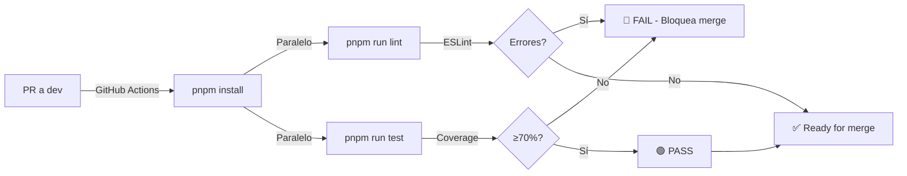

# README — Ahorr-E Monorepo (Arquitectura Desacoplada)

## 🎯 Misión

Migrar un monolito Next.js a una arquitectura de **microservicios desacoplados** basada en **PNPM Workspaces**, garantizando:

- ✅ **Loose Coupling:** Cada servicio es independiente
- ✅ **Edge Runtime Compatible:** Deployable en Supabase + Vercel Edge
- ✅ **Trazabilidad RF/RNF:** Cada componente justificado
- ✅ **Escalabilidad Independiente:** Deploy, upgrades, scaling sin coordinación

---

## 📦 Estructura del Monorepo

```
ahorr-e-monorepo/
├── app/                    # BFF Next.js (API Gateway + Frontend)
├── services/               # Microservicios autónomos
│   ├── scraper/            # Falabella scraping + caché
│   ├── ai/                 # Gemini recommendations
│   └── budget/             # Budget & expense management
├── packages/schemas/       # Tipos compartidos (solo types)
├── docs/
│   └── INFRA.md            # Documentación técnica completa
└── pnpm-workspace.yaml     # Topología del monorepo
```

---

## 🚀 Quick Start

### 1. Instalar PNPM (si no lo tienes)

```bash
npm install -g pnpm
pnpm --version  # Verifica ≥8.0.0
```

### 2. Clonar y configurar

```bash
git clone https://github.com/tuteam/ahorr-e.git
cd ahorr-e
git checkout fixhot/infraestructura

# Instalar dependencias del monorepo
pnpm install
```

### 3. Configurar variables de entorno

```bash
# Copiar templates de env
cp app/.env.example app/.env.local
cp services/scraper/.env.example services/scraper/.env.local
cp services/ai/.env.example services/ai/.env.local
cp services/budget/.env.example services/budget/.env.local

# Editar y rellenar valores (Supabase, API keys, etc.)
nano app/.env.local
```

### 4. Desarrollo local

```bash
# Todos los servicios en paralelo
pnpm run dev

# Outputs:
# → app:              http://localhost:3000
# → services/scraper: http://localhost:3001
# → services/ai:      http://localhost:3002
# → services/budget:  http://localhost:3003
```

### 5. Testing

```bash
# Ejecutar tests globales (todo el monorepo)
pnpm run test

# Watch mode (recarga en cambios)
pnpm run test:watch

# Cobertura detallada
pnpm run test:coverage
```

---

## 🔐 Reglas Estrictas de Gobernanza

### ❌ PROHIBIDO

```typescript
// ❌ Importar entre servicios
// services/scraper/src/index.ts
import { RecommendService } from '../../services/ai/src'  // PROHIBIDO

// ❌ Compartir clientes HTTP
// lib/api-client.ts (compartido globalmente)
export const apiClient = axios.create()  // PROHIBIDO

// ❌ Usar módulos Node.js nativas
// services/scraper/src/cache.ts
import fs from 'fs'  // PROHIBIDO en Edge
```

### ✅ PERMITIDO

```typescript
// ✅ Importar tipos de packages/schemas
import { Product } from '@ahorr-e/schemas'

// ✅ Clientes aislados por servicio
// services/scraper/src/api-client.ts
const client = axios.create()  // ✅ Local, aislado

// ✅ APIs Web estándar
import { URL } from 'url'  // ✅ Funciona en Edge
const data = await fetch(url)  // ✅ Fetch universal
```

---

## 🧪 Testing en Monorepo

### Vitest en Raíz

```bash
# Descubre y ejecuta TODOS los *.test.ts
pnpm run test

# Output esperado:
# ✓ app/api/ai/recomendar.test.ts (3 tests)
# ✓ services/scraper/src/scraper.test.ts (5 tests)
# ✓ services/budget/src/budget.test.ts (4 tests)
# ✓ services/ai/src/recommend.test.ts (6 tests)
# PASS 18 tests
# Coverage: 72% lines, 68% functions
```

### Cobertura Requerida (CI/CD)

| Métrica | Mínimo | Rama |
|---------|--------|------|
| Líneas | 70% | dev |
| Funciones | 70% | dev |
| Ramas | 65% | dev |

Si cae por debajo → PR bloqueado en QA.

---

## 📋 Workflow de Desarrollo

### 1. Crear rama de feature

```bash
git checkout dev
git pull origin dev
git checkout -b feature/nombre-del-feature
```

### 2. Desarrollar

```bash
# Editar código en tu servicio
# Por ejemplo: services/scraper/src/...

# Tests locales
pnpm -F @ahorr-e/scraper run test

# Lint
pnpm run lint
```

### 3. Commit (con trazabilidad RF/RNF)

```bash
git add .
git commit -m "feat(scraper): agregar filtro de precio (RF2, RNF7)

- Implementa búsqueda por rango de precio
- Refuerza caché local (RF2 — max 24h)
- Servicios independientes (RNF7 — escalabilidad)

Trazabilidad:
  RF2: Búsqueda inteligente ✓
  RNF7: Escalabilidad independiente ✓"
```

### 4. Push y abrir PR

```bash
git push origin feature/nombre-del-feature

# En GitHub:
# Abrir PR hacia 'dev' (nunca a master/qa)
# Descripción debe incluir:
#   - Qué RF/RNF implementa
#   - Tests incluidos
#   - Cambios de dependencias (si hay)
```

### 5. Review + Merge

- ✅ Loose Coupling validado (no imports entre servicios)
- ✅ Edge Runtime compatible (sin fs, path, etc.)
- ✅ Tests ≥70%
- ✅ Comentarios técnicos presentes

---

## 🌐 Endpoints de Servicios (Desarrollo)

### app (BFF)
```
GET  /api/scraper/search?q=laptop
GET  /api/ai/recomendar
GET  /api/budget/gastos
POST /api/budget/presupuestos
```

### services/scraper
```
GET /search?q=laptop&category=tech
POST /cache/refresh
```

### services/ai
```
POST /recommend (body: { items, budget })
```

### services/budget
```
GET  /budgets
POST /budgets
GET  /expenses
POST /expenses
```

---

## 📚 Documentación Técnica Completa

👉 **Lee [docs/INFRA.md](docs/INFRA.md) para:**

- Jerarquía detallada del monorepo
- Justificación de Loose Coupling (RNF7)
- Garantías de RLS y Privacidad (RNF1)
- Flujo de comunicación inter-servicios
- Matriz RF/RNF de trazabilidad
- Protocolo de variables de entorno

---

## 🛠️ Scripts Útiles

### Monorepo (raíz)

```bash
# Build todas las dependencias primero, luego servicios
pnpm run build:deps
pnpm run build:services
pnpm run build:app

# Limpiar node_modules y .next
pnpm run clean

# Pre-commit (lint + test, antes de push)
pnpm run precommit

# Base de datos
pnpm run db:generate  # Regenerar Prisma client
pnpm run db:push      # Sync schema a Supabase
pnpm run db:studio    # Abrir Prisma Studio
```

### Por Servicio

```bash
# Solo scraper
pnpm -F @ahorr-e/scraper run test

# Solo ai
pnpm -F @ahorr-e/ai run build

# Solo budget
pnpm -F @ahorr-e/budget run lint
```

---

## 🔗 Flujo CI/CD Esperado (en QA)



---

## 🆘 Troubleshooting

### Error: "Module not found: X"

```bash
# Regenerar lockfile y reinstalar
pnpm install --frozen-lockfile

# Si persiste, limpiar y reinstalar
pnpm run clean
pnpm install
```

### Error: "Edge Runtime no soporta fs"

```bash
# Verificar que NO uses:
grep -r "import.*fs" services/  # Debe estar vacío
grep -r "import.*path" services/  # Debe estar vacío

# Reemplazar con APIs web:
// ❌ const data = fs.readFileSync(path)
// ✅ const data = await fetch(url).then(r => r.json())
```

### Cobertura por debajo de 70%

```bash
# Ver qué lines no tienen cobertura
pnpm run test:coverage

# Abrir reporte HTML
open coverage/index.html

# Agregar tests para cubrir líneas faltantes
```

---

## 👥 Contacto

- **Tech Lead:** Marco Tassara
- **Repo:** [github.com/duocuc/ahorr-e](https://github.com/duocuc/ahorr-e)
- **Issues:** [GitHub Issues](https://github.com/duocuc/ahorr-e/issues)

---

**¡Bienvenido al monorepo desacoplado de Ahorr-E!** 🚀
